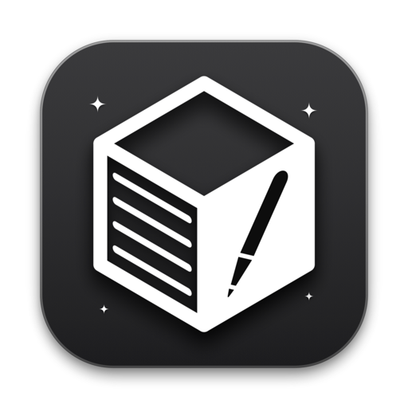

<p align="center">
  
</p>

<h1 align="center">InviNotes</h1>

<p align="center">
  A minimal, real-time collaborative notes app built with Electron.
  <br />
  Create a room, share a link, write together.
</p>

<p align="center">
  
  
  
</p>

---

## Features

- **Real-time collaboration** — Share a link, edit together with live cursors and presence indicators
- **Rich text editor** — Headings, lists, to-do checkboxes, code blocks with syntax highlighting, blockquotes
- **Slash commands** — Type `/` to quickly insert any block type, just like Notion
- **Minimal UI** — Dark theme, distraction-free, Notion-inspired design
- **Always on top** — Stays above other windows for quick reference
- **Adjustable opacity** — Slide to make the window semi-transparent
- **Deep links** — `invinotes://join/<roomId>` opens the app and joins a room directly
- **Cross-platform** — macOS and Windows

## Getting Started

### Prerequisites

- [Node.js](https://nodejs.org/) 18+
- npm

### Install

```bash
# Clone the repo
git clone https://github.com/YOUR_USERNAME/InviNotes.git
cd InviNotes

# Install app dependencies
npm install

# Install server dependencies
cd server && npm install && cd ..
```

### Run

You need two terminals — one for the collaboration server, one for the app.

```bash
# Terminal 1: Start the collaboration server
npm run server

# Terminal 2: Start the app
npm start
```

### Development

```bash
# Watch mode with DevTools
npm run dev

# Launch a second instance for testing collaboration locally
npm run start:peer
```

## How It Works

1. Click **Share** → **Create new room**
2. Copy the invite link and send it to a collaborator
3. They paste the link (or room ID) and click **Join**
4. Both editors sync in real time with live cursors

## Tech Stack

| Layer | Technology |
|-------|-----------|
| Desktop shell | Electron 34.3.0 |
| Editor | TipTap (ProseMirror) |
| Real-time sync | Yjs CRDT + WebSocket |
| Bundler | esbuild |
| Server | Node.js + ws |

## Project Structure

```
src/
  main/main.js           # Electron main process
  preload/preload.js      # IPC bridge (context-isolated)
  renderer/
    app.js                # Entry point (bundled by esbuild)
    editor.js             # TipTap editor setup + extensions
    collaboration.js      # Yjs + WebSocket collaboration manager
    slash-menu.js         # Notion-style slash command menu
    styles/main.css       # Dark theme styles
    index.html            # App shell
server/
    server.js             # Yjs WebSocket sync server
```

## Building

```bash
# macOS (.dmg)
npm run dist:mac

# Windows (.exe)
npm run dist:win
```

## License

ISC
